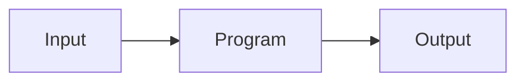

# Introduction

**Focus of the note(class):Automated testing and program analysis**

## Why Do We Need it?

* All software has bugs
* Bugs are hard to find
* Bugs cause serious harm

## What is Program Analysis

Program Analysis is **Automated** analysis of program behavior to, e.g.,

* find programming errors
* optimize performance
* find security vulnerabilities

What Program analysis do to achieve above?

