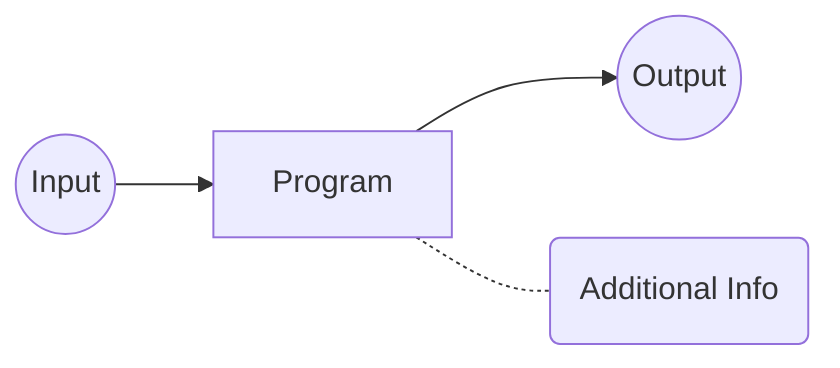

# Introduction

**Focus of the note(class):Automated testing and program analysis**

## Why Do We Need it?

* All software has bugs
* Bugs are hard to find
* Bugs cause serious harm

## What is Program Analysis

Program Analysis is **Automated** analysis of program behavior to, e.g.,

* find programming errors
* optimize performance
* find security vulnerabilities

What Program analysis do to achieve above?

You may feed many Inputs to program analyzed and get output from it, while you get additional information which is exactly what we want.

There are two way of program analysis: Static and Dynamic

|                  Static                   |                  Dynamic                  |
| :---------------------------------------: | :---------------------------------------: |
| Analysis source code, bytecode, or binary |        Analysis program execution         |
|            consider all inputs            |          consider current input           |
|              overapproximate              |             underapproximate              |
| Application： compliers, lint-like tools  | Application: automated testing, profilers |

Now I will cite a picture from prof. Michael's notes to illustrate the term "over-approximate" and "under-approximate"

While Dynamic analysis requires input to run the program, **Test Generation** can creates inputs automatically.

