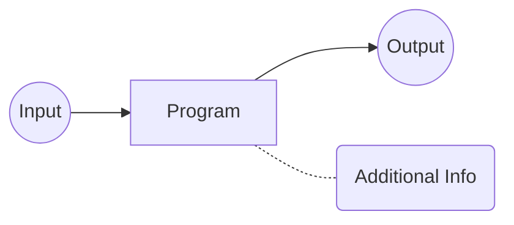

# Introduction

**Focus of the note(class):Automated testing and program analysis**

## Why Do We Need it?

* All software has bugs
* Bugs are hard to find
* Bugs cause serious harm

## What is Program Analysis

Program Analysis is **Automated** analysis of program behavior to, e.g.,

* find programming errors
* optimize performance
* find security vulnerabilities

What Program analysis do to achieve above?



You may feed many Inputs to program analyzed and get output from it, while you get additional information which is exactly what we want.

There are two way of program analysis: Static and Dynamic

|                  Static                   |                  Dynamic                  |
| :---------------------------------------: | :---------------------------------------: |
| Analysis source code, bytecode, or binary |        Analysis program execution         |
|            consider all inputs            |          consider current input           |
|              overapproximate              |             underapproximate              |
| Application： compliers, lint-like tools  | Application: automated testing, profilers |

Now I will cite a picture from prof. Michael's notes to illustrate the term "over-approximate" and "under-approximate"


While Dynamic analysis requires input to run the program, **Test Generation** can creates inputs automatically.

## Foundations

In the following of the notes, the necessary foundations of the lecture will be included.

Generally, PL(Program language) consists of three parts, that is,
$$
PL:= syntax + semantic + implementation
$$
syntax defines the form of the language, semantic defines the meaning of language and implementation executes the language defined. Following we will discuss the Implementation and syntax in detail, while semantics will be discussed later.

### Implementation

There are three types of implementation of a language: Compilation, Interpretation, and hybrid of former two.

1. compilation:

   ```mermaid
   graph LR
   A(source code)
   B[Lexical<br> Analyzer]
   C(Tokens)
   D[syntax<br> Analyzer/<br>parser]
   E(syntax<br> tree)
   F[semantic<br> analysis]
   G[Machine <br>code<br> generator]
   H(Machine<br> language)
   A--> B --> C -->D
   D--> E-->F-->G-->H
   ```

2. Interpretation: Instead of outputting machine languages, it output bytecodes. It will be easier but less efficient than compilation

3. hybrid

For example, gcc is a C compilation, CPython is a interpretation for Python

### Syntax

There are two ways to describe the syntax of a language: Grammar and Abstract syntax Tree

1. Grammar: which programs are syntactically correct?

   There are 4 parts needed to describe the grammar: 

   terminals $\Sigma$, non-terminals $N$, Productions $P$, initial symbol $s\in N$

   Here is a example describe **Arithmetic expression**

   $\Sigma=\{0,1,2,...,9,+,-\}$

   $N=\{Exp,Num,Op,Digit\}$

$s=Exp$
$$
   \begin{aligned}
   P=& Exp\rightarrow Num|Exp\ Op\ Exp\\
   &Op\rightarrow +|-\\
   &Num\rightarrow Digit|Digit\ Num\\
   &Digit\rightarrow 0|1|...|9\\
   \end{aligned}
$$

2. Abstract syntax trees

   1. abstract grammar

      Example of Arithmetic Expression:
      $$
      E\rightarrow n | Op(E,E)\\
      Op\rightarrow +|-
      $$

   2. terminals = tokens

      ```mermaid
      graph TD
      A(+)
      B(3)
      C(45)
      A --> B
      A --> C
      ```

      

      

      

